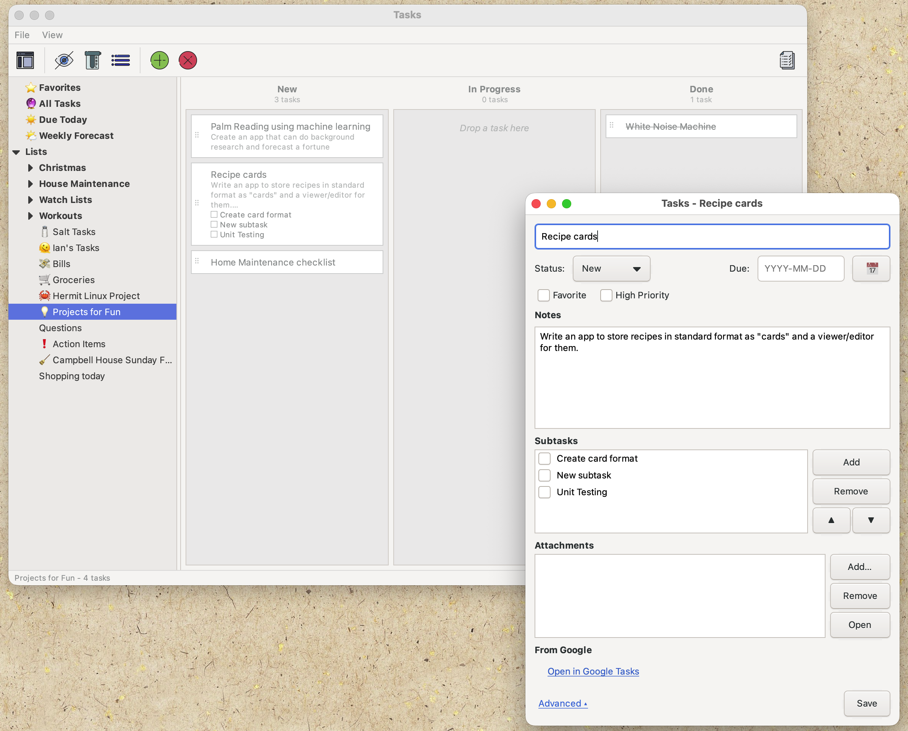

# Tasks

Make lists of tasks. You can give them a due date, or if the task is too big, break it down into subtasks.

Tasks is written in classic C with GTK3 and SQLite. It is a companion app to
[Notes](https://github.com/IANatCAMBIO/Records), built the same way and **with the help
of Claude Code for edits, testing, and code organization**. 
No Electron or interpreted code. 
Low resource usage, and runs on macOS and Linux.



TLDR; Your tasks live in a single SQLite file you can take anywhere.
You organize them in a Library window — lists in the sidebar, tasks in a listview. 
Add subtasks and a color-coded due date to each item. Anything beyond that —
syncing, extra views — is a plugin you switch on.

Want more detail?

- **[User Guide](User_Guide.md)** — everything in depth: the library,
  the task editor, settings, storage, and the plugins.
- **[Internals](Internals.md)** — for the curious: code layout, the
  database schema, and how the plugin ABI works.

## Plugins

Tasks keeps its core small: lists, tasks, subtasks, due dates. Everything
else is a **plugin** — a separate module in the `plugins` folder beside
the program, switched on or off in *File → Settings… → Plugins*, taking
effect immediately.

That is not just tidiness. A plugin you have not enabled is never
opened, so it costs nothing and can bring dependencies the app itself
does not have: without the Google Tasks plugin, Tasks links no network
library at all.

These ship in the box:

| Plugin | What it adds |
|---|---|
| **[Google Tasks Sync](src/plugins/gtasks/README.md)** | Two-way, non-destructive sync with your Google Tasks account. |
| **[Notes Action Items Sync](src/plugins/notes/README.md)** | Mirrors the companion Notes app's `!` action items as ordinary tasks. |
| **[Weekly Forecast](src/plugins/forecast.README.md)** | A sidebar panel of the week, day by day. |
| **[Overdue](src/plugins/overdue.README.md)** | A sidebar view of everything past its due date. |

Each one's README covers what it does, what it needs and every setting
it has — and is reachable from inside the app too, next to the plugin in
the Settings list.

Writing your own is a single C file against the ABI in `src/plugin.h`;
**[Overdue](src/plugins/overdue.README.md)** is the small worked example
and **[Google Tasks Sync](src/plugins/gtasks/README.md)** the large one.

## Building

You'll need a C compiler, the GTK3 and SQLite3 development files, and
pkg-config. libcurl too, but only for the Google Tasks plugin — the
application itself does not link it.

macOS (MacPorts):

```sh
sudo port install pkgconf gtk3 +quartz
sudo port install curl                       # for the Google Tasks plugin
sudo port install gtk-osx-application-gtk3   # optional: native menu bar
make
make run
```

Debian/Ubuntu:

```sh
sudo apt install build-essential pkg-config libgtk-3-dev libsqlite3-dev
sudo apt install libcurl4-openssl-dev        # for the Google Tasks plugin
make
make run
```

Tasks uses emoji extensively (list icons, sidebar labels, task
markers). Debian ships the Noto Color Emoji font, but for Apple-style
emoji install the Apple Color Emoji TTF:

```sh
curl -L "https://github.com/samuelngs/apple-emoji-ttf/releases/download/macos-26-20260722-484daf4e/fonts-apple-color-emoji.deb" \
     -o fonts-apple-color-emoji.deb
sudo dpkg -i fonts-apple-color-emoji.deb
```

`make` builds the `tasks` binary and every plugin, each into
`plugins/<id>.so` alongside its README.

The Makefile auto-detects `gtk-mac-integration-gtk3`; if you install it
later, rebuild from clean (`make clean && make`) so every file sees it.
On macOS, `make app` wraps the binary into `dist/Tasks.app` (it still
links against the MacPorts GTK libraries, so the bundle runs on the
machine that built it).

If you want to sign in to Google with your own OAuth client rather than
the one baked in, see
[the Google Tasks plugin's README](src/plugins/gtasks/README.md).
