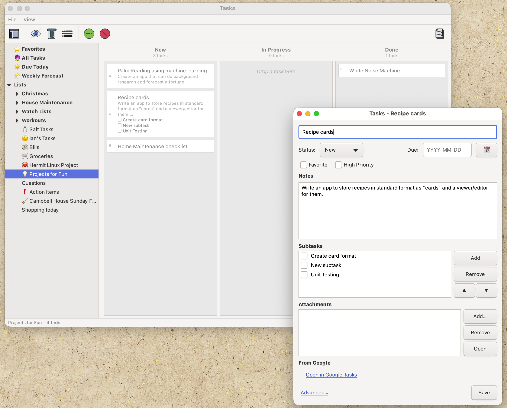

# Tasks

Make lists of tasks. You can give them a due date, or if the task is too big, break it down into subtasks.

Tasks is written in classic C with GTK3 and SQLite. It is a companion app to
[Notes](https://github.com/IANatCAMBIO/Records), built the same way and **with the help
of Claude Code for edits, testing, and code organization**. 
No Electron or interpreted code. 
Low resource usage, and runs on macOS and Linux.



TLDR; Your tasks live in a single SQLite file you can take anywhere.
You organize them in a Library window — lists in the sidebar, tasks in a listview
or on a Kanban board. 
Add subtasks and a color-coded due date to each item, and set a repeat on
the ones that come back round — daily, weekly, monthly or an interval of
your own — and Tasks reopens them and moves the due date on as each one
falls due.

Want more detail?

- **[User Guide](User_Guide.md)** — everything in depth: the library,
  the task editor, settings and storage.
- **[Internals](Internals.md)** — for the curious: code layout and the
  database schema.

Google Tasks sync and the Notes action-item mirror, which earlier
builds carried as plugins, are not in this build. They return as
integrated features once the GTK4 port is complete.

## Building

You'll need a C compiler, the GTK3 and SQLite3 development files, and
pkg-config.

macOS (MacPorts):

```sh
sudo port install pkgconf gtk3 +quartz
sudo port install gtk-osx-application-gtk3   # optional: native menu bar
make
make run
```

Debian/Ubuntu:

```sh
sudo apt install build-essential pkg-config libgtk-3-dev libsqlite3-dev
make
make run
```

Tasks uses emoji extensively (list icons, sidebar labels, task
markers). Debian ships the Noto Color Emoji font, but for Apple-style
emoji install the Apple Color Emoji TTF:

```sh
curl -L "https://github.com/samuelngs/apple-emoji-ttf/releases/download/macos-26-20260722-484daf4e/fonts-apple-color-emoji.deb" \
     -o fonts-apple-color-emoji.deb
sudo dpkg -i fonts-apple-color-emoji.deb
```

The Makefile auto-detects `gtk-mac-integration-gtk3`; if you install it
later, rebuild from clean (`make clean && make`) so every file sees it.
On macOS, `make app` wraps the binary into `dist/Tasks.app` (it still
links against the MacPorts GTK libraries, so the bundle runs on the
machine that built it).
